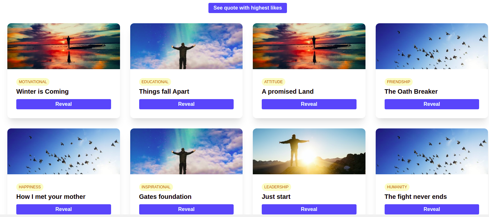
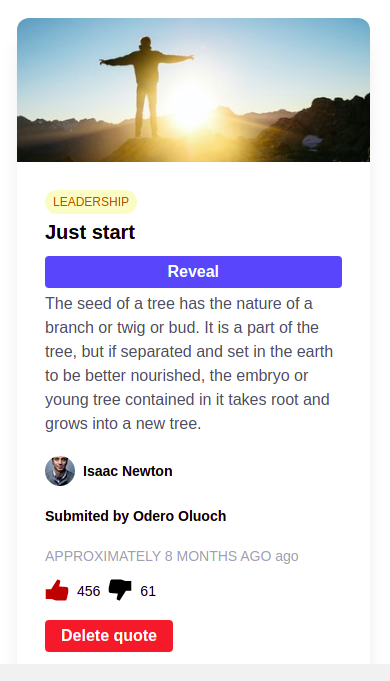
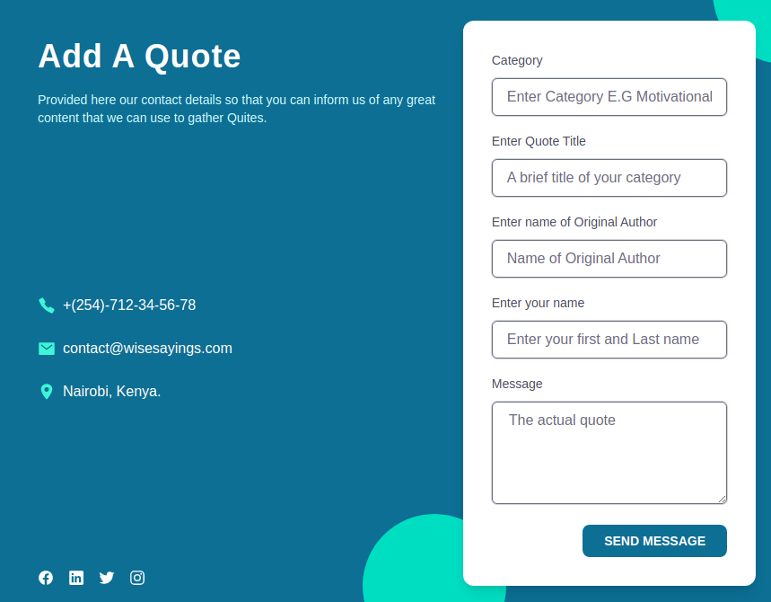

# Wise-Sayings
####  **Odero OLuoch**

Landing Page

Quote Detail View

New Quote Form

## Description
The original idea, was to assemble all quotes from Game of Thrones and allow users to add, delete and like or dislike their favorite. It later got opend up for all other movies, then settled to any other quote. Users are now able to add quotes from all catgories of life.

A button is put at the top of the web page for a user who is qurious to know the quote with the highest vote count.

## Technologies used
- Angular CLI
- TypeScript
- Tailwind CSS
- HTML

## Bugs being worked on
- The color change effect on the like and unlike button
- Disabling like button when unlike is true, or disabling unlike button when like is true.
- The submit form does not clear when a user clreates a new quote
- The page remains on the form once the user creates a new quote
- Time zone for time elapsed calulatons.

This project was generated with [Angular CLI](https://github.com/angular/angular-cli) version 11.2.12.

## Installation
Assuming you have Angular CLI installed, clone this project and navigate to the project folder. Run `yarn install` to download the required dependencies.

Run `ng serve` for a dev server. Navigate to `http://localhost:4200/`. The app will automatically reload if you change any of the source files. Alternatively, you can run `ng serve --open` or the shorthand `ng s -o` and the server will automatically open the app on the browser.

## Build

Run `ng build` to build the project. The build artifacts will be stored in the `dist/` directory. Use the `--prod` flag for a production build.

## Further help

To get more help on the Angular CLI use `ng help` or go check out the [Angular CLI Overview and Command Reference](https://angular.io/cli) page.

## Support and contact details
To help grow and make this product better, reach out to [email](mailto:oderoluoch@gmail.com).
### LICENSE

Copyright &copy; 2021 **[Odero OLuoch](www.github.com/OderoOluoch)**

